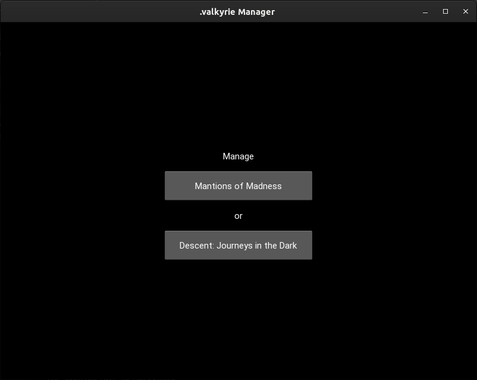
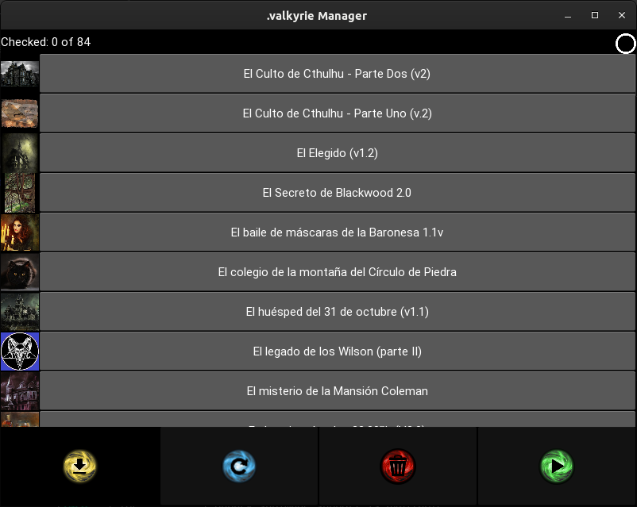
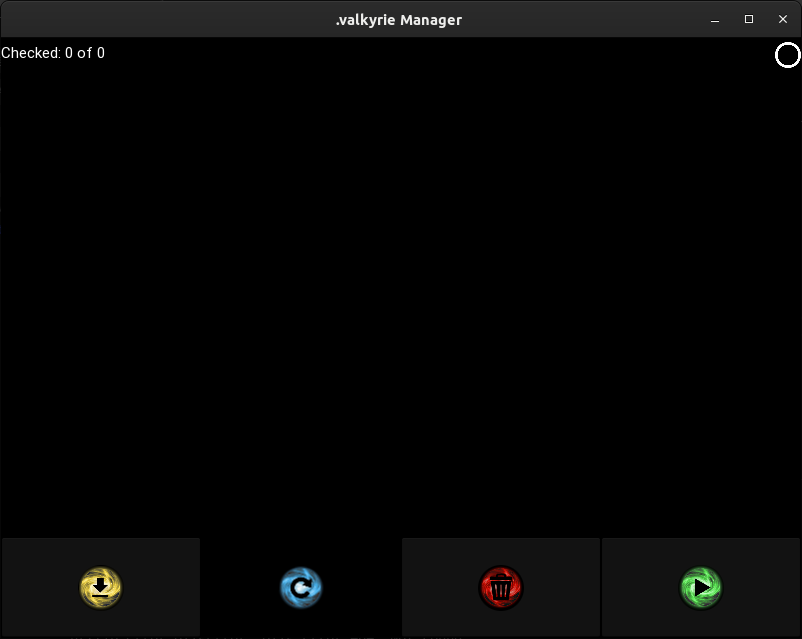
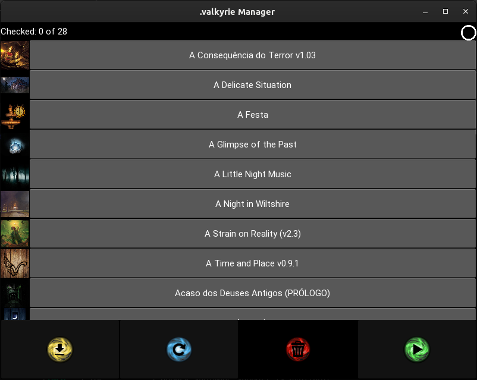
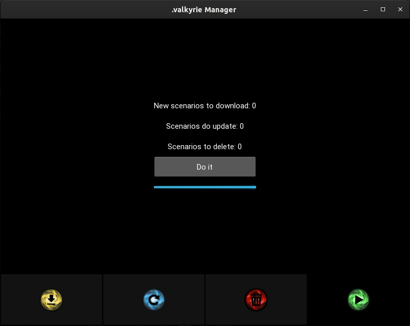

# .valkyrie Manager

This is Python 3.9/Kivy 2.0 application that helps to manage quest (.valkyrie) files.

It identifies new quests and quests with avialable update, allowing to download none, some or all at once.

It is possible to remove none, some ot all downloaded quests too.

Its interface displays each category of quest (new, updatable or removable) and user can mark any of displayed quests to operate (download, update or remove).

## Requirements

To execute this application somethings are required:

1. Installed and working Valkyrie app
2. Compatible O.S. (Windows, Linux or Mac)
3. Python 3.9
4. Kivy 2.0

## Installing Kivy

Kivy is a Python library that may be installed pip and require.txt.

Kivy may be installed using requirments file or directaly with:

    pip3 install -r require.txt

or

    pip3 install kivy

Some Python installations may require installation of *pip3*. Depending on your Python installation these commands may be changed to:

    pip install -r require.txt

or

    pip install kivy

## Executing

Before execute at first time configure the scenariosmanager.ini. Change unique value in this file to your local configuration.

After that, execute on a terminal (or create a application launcher with one of following commands):

    python3 main.py

or

    python main.py

Depending on your Python installation.

## Executed Compatibility Test

This application were well execute on:

- Ubuntu Linux 21.10
- Fedora Linux 35

## Scrennshots

